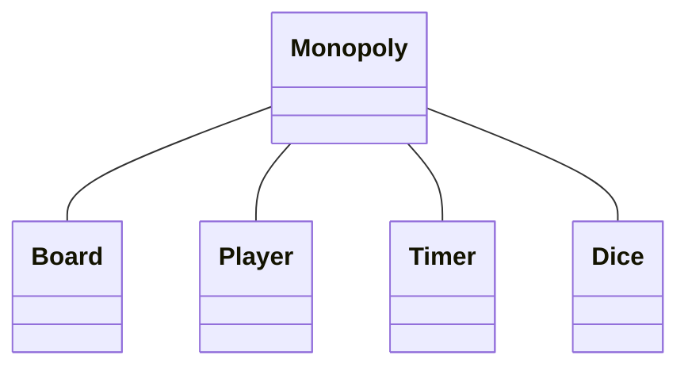

# Monopoly

[Project Proposal](https://youtu.be/geBF1JrwKsQ)

In the game, players roll two six-sided dice to move around the game board, buying and trading properties, and developing them with houses and hotels. Players collect rent from their opponents, with the goal being to drive them into bankruptcy. Money can also be gained or lost through Chance and Community Chest cards, and tax squares; players can end up in jail, which they cannot move from until they have met one of several conditions.
The objective of the game is to become the wealthiest player through buying, renting and selling property.

## Components

-   Board
-   Die (2)
-   Token for each player
-   House (32)
-   Hotel (12)
-   Chance and Community Chest cards (16)
-   Title Deed cards for each property (28)
-   Money

## PREPARATION

-	Each player chooses one token to represent him/her while traveling around the board.
-	Each player is given $1500 divided as follows: 2 each of $500’s,$100’s and $50’s; 6 $20’s; 5 each of $10’s, $5’s and $1’s.
-	All remaining money and other equipment go to the Bank.

## Class Diagram

